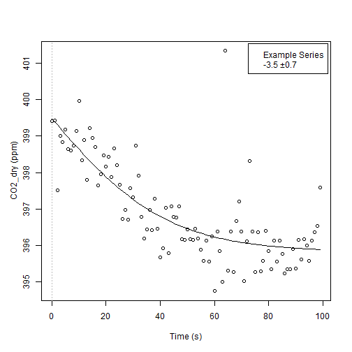

<!-- 
README.md is generated from README.Rmd. Please edit that file
knit("README.Rmd") 
-->


<!-- 
[](http://cran.r-project.org/package=logitnorm)
-->


## Overview

`RespChamberProc` package supports deriving gas fluxes from a time series of gas
concentrations in a chamber.

<!-- 
## Installation

```r
# From CRAN
install.packages("logitnorm")

# Or the the development version from GitHub:
# install.packages("devtools")
devtools::install_github("bgctw/logitnorm")
```
-->


## Usage

See the package vignettes for an introduction.

A simple example estimates photosynthesis (negative CO2 flux into the
light chamber) in units micromol/second from CO2 concentration data in ppm.
 

```r
data(chamberLoggerEx1s)
ds <- chamberLoggerEx1s
ds$Pa <- chamberLoggerEx1s$Pa * 1000  # convert kPa to Pa
ds$CO2_dry <- corrConcDilution(ds)    # correct for water vapour
resFit <- calcClosedChamberFlux(ds
		, colConc = "CO2_dry", colTime = "TIMESTAMP"	# colum names conc ~ timeInSeconds
		, colTemp = "TA_Avg", colPressure = "Pa"		# Temperature in K, Pressure in Pa
		, volume = 1, area = 1						    # chamber dimensions m3 and m2
)
resFit$stat[c("flux","sdFlux")]
#>      flux    sdFlux 
#> -3.534763  0.708469
plotResp(ds, resFit, label="Example Series")
```


